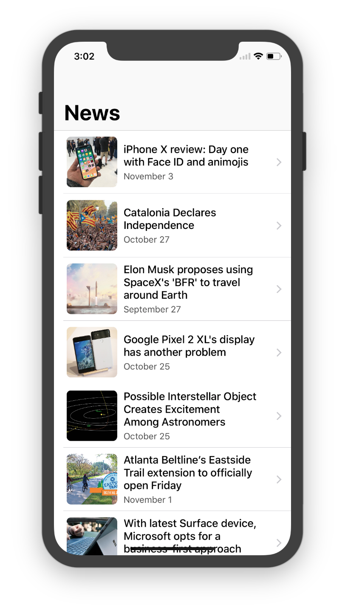
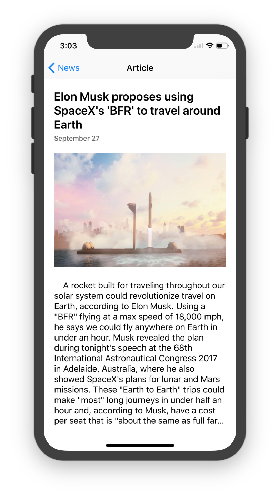
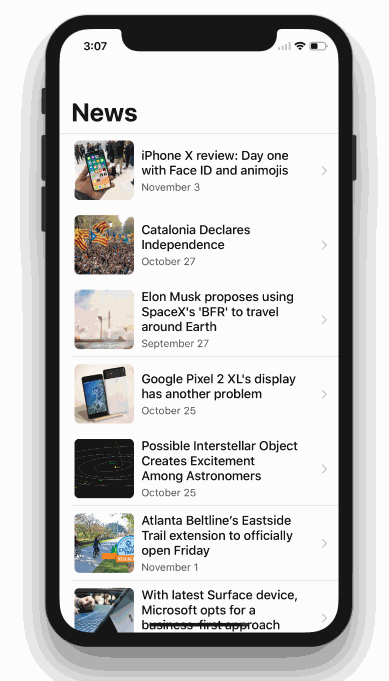

## News App *Spec Challenge*

This is a starter template for the News App Spec Challenge. It includes an `Article.swift` file with seven predefined news articles. Each article has a headline, a date, an image, and some body text. All of the images are included in `Assets.xcassets`.

### Final Product

A typical final product using this template would include two screens. The first screen would show all of the article headlines in either a `UITableView` or `UICollectionView`. The second screen should be presented when the user taps on one of the headlines, and it should show the full article.

#### Screenshots

     

#### GIF

    

#### Code

If you're stumped, you can take a look at a [fully completed version](https://github.com/iosgatech/News-App-Fall17) of the app.